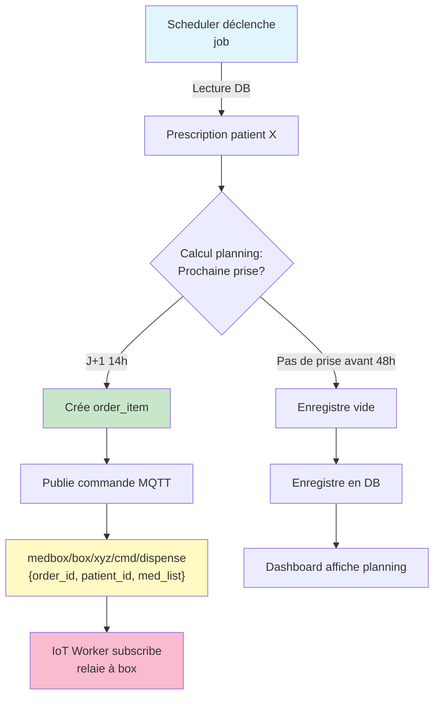
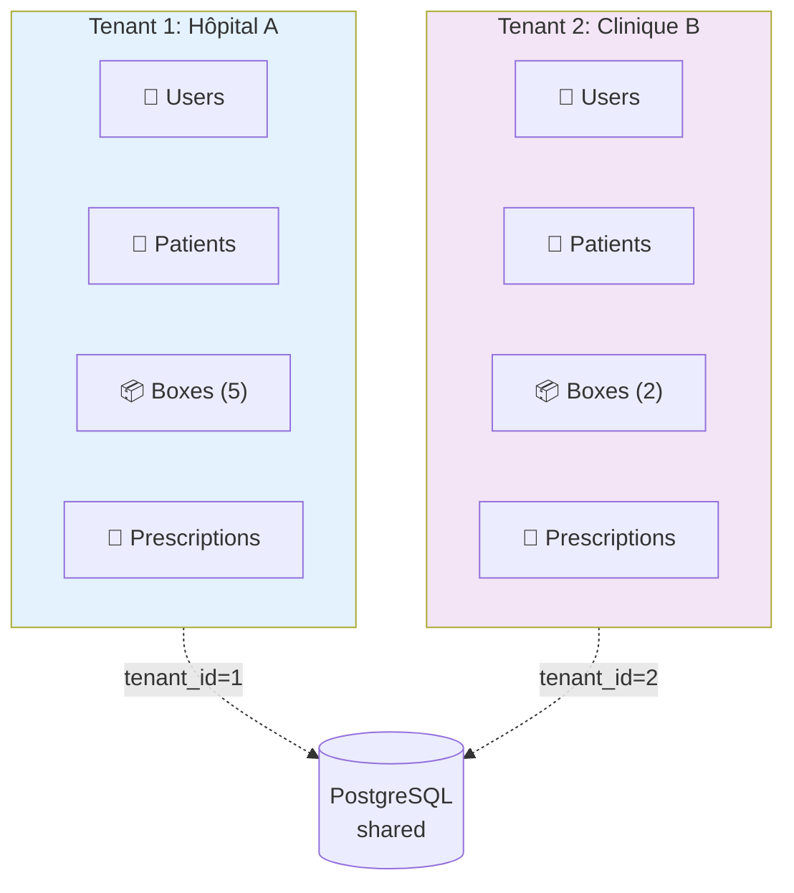

# 🏗️ Architecture MEDBOX - Vue d'ensemble système

**Date**: Décembre 2025 | **Version**: 0.1.0 | **Langue**: Français

---

## 📋 Table des matières

1. [Vue d'ensemble globale](#vue-densemble-globale)
2. [Les 4 composants clés](#les-4-composants-clés)
3. [Flux de données](#flux-de-données)
4. [Modèle multi-tenant](#modèle-multi-tenant)
5. [Sécurité & authentification](#sécurité--authentification)
6. [Protocole MQTT](#protocole-mqtt)
7. [Structure du projet](#structure-du-projet)
8. [Points de contact clés](#points-de-contact-clés)

---

## Vue d'ensemble globale

MEDBOX est un système de **distribution automatisée de médicaments** combinant :

- 🎁 **Boîtiers IoT** (ESP32) : exécution d'ordres, contrôle physique, remontée d'événements
- 🧠 **Backend API** (FastAPI) : orchestration métier, décisions, règles
- ⚡ **IoT Worker** (Runner temps réel) : traducteur MQTT ↔ DB
- ⏰ **Scheduler Worker** : tâches planifiées, jobs asynchrones

```
┌─────────────────────────────────────────────────────────────────┐
│                     MEDBOX Architecture                          │
└─────────────────────────────────────────────────────────────────┘

    ┌──────────────────────────────────────────────────────────┐
    │                  Frontend / Users                        │
    │           (Patients, Soignants, Admins)                  │
    └────────────────────┬─────────────────────────────────────┘
                         │ HTTPS
                         ▼
    ┌──────────────────────────────────────────────────────────┐
    │          🧠 Backend API (FastAPI) - Port 8000            │
    │  ┌──────────────┐  ┌──────────────┐  ┌──────────────┐   │
    │  │  Routes v1   │  │  Services    │  │ Repositories │   │
    │  │  (tenants,   │  │  (business   │  │  (database   │   │
    │  │   patients,  │  │   logic)     │  │   access)    │   │
    │  │ prescriptions│  │              │  │              │   │
    │  └──────────────┘  └──────────────┘  └──────────────┘   │
    └─────────┬──────────────────────────┬────────────────────┘
              │                          │
              │ Redis / DB               │ PostgreSQL
              ▼                          ▼
    ┌──────────────────────────────────────────────────────────┐
    │           Broker MQTT (medbox/box/+/evt/#)              │
    │              (Topic-based pub/sub)                       │
    └────────┬──────────────────────────┬─────────────────────┘
             │                          │
             ▼                          ▼
    ┌──────────────────────┐  ┌────────────────────────────┐
    │  ⚡ IoT Worker        │  │  ⏰ Scheduler Worker       │
    │  (Real-time)         │  │  (Async jobs)              │
    │  ┌────────────────┐  │  │  ┌──────────────────────┐ │
    │  │ Subscribe evt  │  │  │  │ Calcul plannings    │ │
    │  │ Valider        │  │  │  │ Déclenchement prises│ │
    │  │ Écrire en DB   │  │  │  │ Agrégation métriques│ │
    │  └────────────────┘  │  │  │ Nettoyage expirations│ │
    │  Publish commandes   │  │  └──────────────────────┘ │
    └──────────┬───────────┘  │  Lit/écrit DB & Redis     │
               │              └────────┬───────────────────┘
               │                       │
               └───────────┬───────────┘
                           │ MQTT (mTLS certs)
                           ▼
            ┌──────────────────────────────────────────┐
            │  📦 Physical Boxes (ESP32)               │
            │  ┌──────────────────────────────────────┤
            │  │ • Exécute ordres uniquement            │
            │  │ • Gère contrôle physique (verrou)     │
            │  │ • Détecte événements (porte, chute)   │
            │  │ • Remonte telemetry (batterie, temp)  │
            │  └──────────────────────────────────────┘
            └──────────────────────────────────────────┘
```

---

## Les 4 composants clés

### 1️⃣ API Backend (FastAPI)

**Rôle**: Orchestrateur métier unique — définit règles, décide quoi/quand/si une box distribue.

**N'a PAS**:
- Pas de temps réel dur (200ms de latence acceptable)
- Pas de communication directe avec les boxes
- Pas de logique d'exécution physique

**Responsabilités**:

| Fonction | Fichier(s) | Notes |
|----------|-----------|-------|
| **Gestion tenants** | `core/services/tenant.py` | Multi-tenant strict |
| **Authentification utilisateurs** | `core/services/security.py` | Via Keycloak (OIDC) |
| **RBAC (droits)** | `core/services/tenant_right.py` | Par tenant |
| **Gestion boxes & roues** | `core/db/models/box.py`, `wheel.py` | Inventaire matériel |
| **Prescriptions & plannings** | `core/db/models/prescription.py` | Logique métier prise |
| **Calcul plannings** | `core/services/` | Décision quand prescrire |
| **Historisation événements** | `core/db/models/event.py` | Traçabilité complète |
| **Supervision globale** | Routes `api/routes/v1/` | États, erreurs, métriques |

**Stack**: FastAPI 0.110, SQLAlchemy 2.0.25 (async), asyncpg, Pydantic 2.x

**Démarrage**:
```bash
poetry run api          # Production
poetry run api-dev      # Hot-reload dev
```

**Point d'entrée**: `medbox/api/main.py`

---

### 2️⃣ IoT Worker (Runner temps réel MQTT)

**Rôle**: Traducteur bidirectionnel temps réel MQTT ↔ Base de données.

**Ce qu'il fait**:
- ✅ Subscribe à `medbox/box/+/evt/#` (tous événements boxes)
- ✅ Valide payload JSON selon schéma attendu
- ✅ Écrit en base : prises, erreurs, ouvertures, telemetry
- ✅ Publie commandes vers boxes (si API l'ordonne)
- ❌ N'a PAS de logique métier lourde
- ❌ N'a PAS de calcul de planning
- ❌ Stateless (aucun état interne persistant)

**Topics MQTT observés**:

```
medbox/box/{box_id}/evt/take          → Prise effectuée (succès)
medbox/box/{box_id}/evt/error         → Erreur prise (timeout, blocage)
medbox/box/{box_id}/evt/door_open    → Porte ouverte (maintenance)
medbox/box/{box_id}/evt/medication_fall  → Chute détectée
medbox/box/{box_id}/evt/telemetry    → Telemetry (batterie, temp, état roue)
```

**Topics publiés** (par API ou Scheduler via MQTT):

```
medbox/box/{box_id}/cmd/dispense      → Ordre de dispensation
medbox/box/{box_id}/cmd/display       → Mise à jour écran patient
medbox/box/{box_id}/cmd/lock          → Verrou (actif/inactif)
```

**Statut**: ⚠️ Implémentation incomplète (voir `todo.md`)

**Fichiers**:
- `medbox/iotworker/main.py` — Point d'entrée
- `medbox/iotworker/broker.py` — Configuration broker MQTT
- `medbox/iotworker/tasks/` — Handlers événements

**Démarrage**:
```bash
poetry run iot-worker
```

---

### 3️⃣ Scheduler Worker (Tâches planifiées asynchrones)

**Rôle**: Responsable de tout ce qui est planifié, différé ou agrégé.

**Fonctions clés**:

| Tâche | Description | Fréquence |
|-------|-------------|-----------|
| **Calcul plannings** | Décide quand et quoi prescrire | À la demande |
| **Déclenchement prises** | Lance ordres à l'heure prévue | Toutes les heures |
| **Rotation plannings** | Recalcul J+1, J+2, J+3 | Quotidien |
| **Agrégation métriques** | Résumé journalier boxes | Nocturne |
| **Nettoyage** | Expiration invitations, statuts | Hebdo |
| **Surveillance boxes** | Détecte offline, batterie basse | Toutes les 5 min |

**Technologie**: Dramatiq + Redis (queue persistante)

**Statut**: ⚠️ Configuration minimale (voir `todo.md`)

**Fichiers**:
- `medbox/schedulerworker/main.py` — Point d'entrée
- `medbox/schedulerworker/broker.py` — Configuration Dramatiq
- `medbox/schedulerworker/tasks/` — Définition des jobs

**Démarrage**:
```bash
poetry run scheduler-worker
```

---

### 4️⃣ Box (ESP32 IoT)

**Rôle**: Exécutant déterministe — n'exécute que ce qu'on lui ordonne.

**Capacités**:
- ✅ Affiche infos patient (écran LVGL)
- ✅ Détecte événements physiques (porte, chute, roue)
- ✅ Exécute dispensation (déverrouille, tourne roue, délivre)
- ✅ Remonte télémétrie (batterie, température, état)
- ❌ Zéro logique métier
- ❌ Zéro décisions
- ❌ Zéro calculs de planning

**Communication**: MQTT uniquement, certificats mTLS

**Schéma événement typique**:
```json
{
  "box_id": "box_001",
  "event_type": "take",
  "timestamp": "2025-12-21T14:30:00Z",
  "prescription_id": "presc_42",
  "status": "success",
  "telemetry": {
    "battery_percent": 87,
    "temperature": 22.5,
    "wheel_position": 3
  }
}
```

---

## Flux de données

### Flux 1: Prise médicament (Happy Path)

```mermaid
sequenceDiagram
    participant User as User (Patient)
    participant Box as Box (ESP32)
    participant MQTT as MQTT Broker
    participant IoT as IoT Worker
    participant DB as PostgreSQL

    User->>Box: Appui bouton "Prendre med"
    activate Box
    
    Box->>Box: Déverrouille<br/>Tourne roue slot
    Box->>Box: Dispense médicament
    Box->>Box: Enregistre temps
    
    Box->>MQTT: Publie evt/take<br/>{success, timestamp}
    deactivate Box
    
    activate MQTT
    MQTT->>IoT: Délivre message
    deactivate MQTT
    
    activate IoT
    IoT->>IoT: Valide payload
    IoT->>DB: INSERT event<br/>UPDATE prescription<br/>status=taken
    deactivate IoT
    
    DB-->>IoT: OK
    Note over DB: Traçabilité complète enregistrée
```

### Flux 2: Erreur prise + Alertes

```mermaid
sequenceDiagram
    participant Box as Box (ESP32)
    participant MQTT as MQTT Broker
    participant IoT as IoT Worker
    participant DB as PostgreSQL
    participant API as Backend API

    Box->>Box: Tentative dispensation
    Box->>Box: ❌ Roue bloquée (timeout)
    
    Box->>MQTT: Publie evt/error<br/>{error_code: WHEEL_STUCK}
    
    activate MQTT
    MQTT->>IoT: Délivre message
    deactivate MQTT
    
    activate IoT
    IoT->>IoT: Valide
    IoT->>DB: INSERT event<br/>status=error<br/>UPDATE box<br/>status=maintenance_needed
    deactivate IoT
    
    DB-->>API: Notification (webhook/polling)
    activate API
    API->>API: Alerte soignant<br/>"Box XYZ nécessite maintenance"
    deactivate API
    
    Note over DB: Maintenance requise documentée
```

### Flux 3: Calcul planning (Scheduler)



---

## Modèle multi-tenant

Chaque **tenant** = organisation/établissement médical isolé.

### Principes clés

1. **Cloisonnement strict au niveau DB**
   - Toute entité a un `tenant_id`
   - Requêtes filtrées systématiquement par tenant
   - Aucun cross-tenant possible

2. **Isolation Keycloak**
   - Utilisateurs liés à un tenant Keycloak realm
   - JWT token contient `tenant_id` (claim custom)

3. **Boxes & équipement**
   - Chaque box appartient à un tenant
   - Roues, prescriptions, patients scoped au tenant



### Fichiers clés multi-tenant

| Fichier | Responsabilité |
|---------|-----------------|
| `core/services/tenant_right.py` | Vérification droits par tenant |
| `core/services/security.py` | Extraction `tenant_id` du JWT |
| `api/middlewares/auth.py` | Middleware tenant context |
| Tous modèles `core/db/models/*.py` | Tous ont champ `tenant_id` |

---

## Sécurité & authentification

### 1. Utilisateurs

**Protocole**: OIDC via Keycloak

```
1. User → Frontend: Email/Password
2. Frontend → Keycloak: Authentifie
3. Keycloak → Frontend: JWT token (+ refresh token)
4. Frontend → Backend: Bearer JWT
5. Backend: Valide sig + expire + tenant_id claim
6. ✅ Accès accordé au tenant
```

**Dépendances**: `python-keycloak`, `python-jose`

**Point d'entrée**: `core/services/security.py::get_current_user()`

### 2. Boxes (Certificats mTLS)

**Protocole**: mTLS MQTT

```
Box (ESP32):
  - Certificat signé CA spécifique tenant
  - Clé privée stockée en flash (protégée)
  - Chaque box = certificat unique

Broker MQTT:
  - Valide certificat CA
  - Extrait box_id du CN (Common Name)
  - Autorise uniquement topics du box_id
```

**Topics autorisés par box**:
- ✅ `medbox/box/{BOX_ID}/evt/#` — Publish uniquement propres événements
- ✅ `medbox/box/{BOX_ID}/cmd/#` — Subscribe uniquement propres commandes
- ❌ Pas accès topics autres boxes

### 3. Données sensibles

**Chiffrement au repos** (crypto Python):

```
Champs sensibles → c_* (encrypted_*)
Exemple: c_patient_name, c_medication_name

Fonction: core/utils/crypto.py::encrypt/decrypt()
Clé: Stockée variable d'environnement (ou Vault)
Algorithme: Fernet (AES-128-CBC + HMAC)
```

**En transit**:
- HTTPS pour API ✅
- TLS 1.2+ pour MQTT ✅
- Pas de données médicales en clair dans MQTT ✅

**Fichiers**: `core/utils/crypto.py`, `core/db/types.py` (type SQLAlchemy custom)

---

## Protocole MQTT

### Topologie Topics

```
medbox/                                  ← Racine
├── box/                                 ← Classe box
│   ├── {box_id}/                        ← Instance spécifique
│   │   ├── evt/                         ← Événements box → backend
│   │   │   ├── take                     (Prise effectuée)
│   │   │   ├── error                    (Erreur)
│   │   │   ├── door_open               (Porte ouverte)
│   │   │   ├── medication_fall         (Chute détectée)
│   │   │   └── telemetry               (Telemetry temps réel)
│   │   │
│   │   └── cmd/                         ← Commandes backend → box
│   │       ├── dispense                (Ordre dispensation)
│   │       ├── display                 (Update écran)
│   │       ├── lock                    (Verrou on/off)
│   │       └── ack                     (Accusé réception)
│   │
│   └── {other_box_ids}/...
│
├── tenant/                              ← Commandes au niveau tenant
│   ├── {tenant_id}/
│   │   └── cmd/...
│   │
└── system/                              ← Topics système
    ├── status                          (Heartbeat, uptime)
    └── metrics                         (Agrégations, KPI)
```

### Format message (JSON)

**Événement prise**:
```json
{
  "box_id": "box_001",
  "event_type": "take",
  "timestamp": "2025-12-21T14:30:00Z",
  "prescription_id": "presc_42",
  "patient_id": "pat_10",
  "medication_id": "med_5",
  "status": "success",
  "telemetry": {
    "battery_percent": 87,
    "temperature": 22.5,
    "wheel_position": 3,
    "door_opened": false
  }
}
```

**Commande dispensation**:
```json
{
  "order_id": "ord_999",
  "box_id": "box_001",
  "prescription_id": "presc_42",
  "patient_id": "pat_10",
  "medications": [
    {
      "medication_id": "med_5",
      "wheel_slot": 3,
      "quantity": 1
    }
  ],
  "scheduled_time": "2025-12-21T14:30:00Z",
  "timeout_ms": 30000
}
```

### QoS & Reliability

| Topic | QoS | Raison |
|-------|-----|--------|
| `evt/*` | 1 | Au moins une fois (telemetry peut être reperdue) |
| `cmd/*` | 2 | Exactement une fois (commande critique) |
| `system/*` | 0 | Fire & forget (métriques informatives) |

---

## Structure du projet

```
medbox/
├── api/                           ← FastAPI app
│   ├── main.py                    (Point d'entrée, uvicorn run)
│   ├── routes/
│   │   ├── router_v1.py           (Root router v1)
│   │   └── v1/
│   │       ├── health.py          (GET /health)
│   │       ├── tenant.py          (Tenant management)
│   │       ├── patient.py         (Patient CRUD)
│   │       ├── prescription.py    (Prescription logic)
│   │       ├── box.py             (Box inventory)
│   │       ├── wheel.py           (Wheel config)
│   │       ├── oauth2.py          (Keycloak flows)
│   │       └── invitation.py      (Tenant invites)
│   ├── deps/
│   │   ├── response.py            (Response wrappers)
│   │   └── __init__.py            (FastAPI dependencies injection)
│   └── middlewares/
│       └── auth.py                (JWT auth middleware)
│
├── core/                          ← Business logic & infrastructure
│   ├── config/
│   │   └── settings.py            (Pydantic settings, env vars)
│   ├── constants/
│   │   └── enums.py               (Enums globaux: statuts, types)
│   ├── db/
│   │   ├── base.py                (Declarative base SQLAlchemy)
│   │   ├── session.py             (Async session factory)
│   │   ├── types.py               (Custom SQLAlchemy types)
│   │   ├── models/
│   │   │   ├── _mixins.py         (Base class, timestamps)
│   │   │   ├── tenant.py
│   │   │   ├── user.py
│   │   │   ├── patient.py
│   │   │   ├── prescription.py
│   │   │   ├── prescription_item.py
│   │   │   ├── box.py
│   │   │   ├── wheel.py
│   │   │   ├── wheel_slot.py
│   │   │   ├── wheel_slot_prescription_item.py
│   │   │   ├── event.py           (Audit trail)
│   │   │   ├── global_medication.py
│   │   │   ├── telemetry.py
│   │   │   └── invitation.py
│   │   └── repositories/
│   │       ├── base.py            (Base repository pattern)
│   │       ├── tenant.py
│   │       ├── user.py
│   │       ├── patient.py
│   │       └── invitation.py
│   │
│   ├── dto/                       ← Data Transfer Objects
│   │   ├── auth.py
│   │   ├── tenant.py
│   │   ├── patient.py
│   │   ├── page.py                (Pagination)
│   │   └── invitation.py
│   │
│   ├── schemas/
│   │   └── __init__.py
│   │
│   ├── services/                  ← Business services
│   │   ├── security.py            (Auth, JWT validation)
│   │   ├── tenant.py              (Tenant ops)
│   │   ├── user.py                (User ops)
│   │   ├── tenant_right.py        (RBAC)
│   │   ├── tenant_invitation.py   (Invitation workflow)
│   │   └── __init__.py
│   │
│   ├── exceptions/
│   │   ├── not_found.py
│   │   └── __init__.py
│   │
│   ├── tasks/
│   │   └── invitation_tasks.py    (Async background tasks)
│   │
│   ├── utils/
│   │   ├── crypto.py              (Fernet encrypt/decrypt)
│   │   └── __init__.py
│   │
│   └── __init__.py
│
├── iotworker/                     ← MQTT IoT Worker
│   ├── __main__.py                (CLI entry: poetry run iot-worker)
│   ├── main.py                    (Setup & run)
│   ├── broker.py                  (MQTT broker config)
│   └── tasks/
│       ├── test.py
│       └── __init__.py
│
├── schedulerworker/               ← Scheduler async jobs
│   ├── __main__.py                (CLI entry: poetry run scheduler-worker)
│   ├── main.py                    (Setup & run)
│   ├── broker.py                  (Dramatiq broker config)
│   └── tasks/
│       ├── test.py
│       └── __init__.py
│
└── __init__.py

migrations/                        ← Alembic DB migrations
├── env.py
├── script.py.mako
└── versions/
    ├── 56b761bc6dba_initial_schema.py
    └── ...

tests/                             ← Pytest test suite
├── conftest.py
├── test_crypto.py
├── test_encrypted_type.py
└── test_encrypted_update.py

docs/
├── readme.md                       ← API & business flows
├── database.md                     ← DB schema + ERD
└── architecture.md                 ← Ce fichier

pyproject.toml                      ← Poetry config, dépendances, scripts CLI
pytest.ini                          ← Pytest config
alembic.ini                         ← Alembic config
```

---

## Points de contact clés

### 🎯 Ajouter un nouvel endpoint API

1. **Créer DTO** → `core/dto/mon_domaine.py`
2. **Créer service** → `core/services/mon_domaine.py`
3. **Créer route** → `api/routes/v1/mon_domaine.py`
4. **Importer dans router** → `api/routes/router_v1.py`

**Exemple**: `api/routes/v1/patient.py` appelle `core/services/patient.py`

### 🎯 Ajouter un nouveau modèle DB

1. **Créer modèle** → `core/db/models/mon_entite.py`
2. **Créer migration** → `alembic revision --autogenerate -m "Add mon_entite"`
3. **Optionnel: créer repository** → `core/db/repositories/mon_entite.py`
4. **Tester migration** → `alembic upgrade head`

### 🎯 Traiter nouvel événement MQTT

1. **Créer handler** → `iotworker/tasks/mon_event.py`
2. **Valider payload** → Utiliser Pydantic model
3. **Écrire en DB** → Via repository
4. **Optionnel: déclencher action** → Publier job Scheduler

**Exemple**: `iotworker/tasks/test.py` = template

### 🎯 Ajouter job Scheduler asynchrone

1. **Créer task** → `schedulerworker/tasks/mon_job.py`
2. **Décorer avec `@dramatiq.actor`**
3. **Scheduler appelle** → `mon_job.send()` ou `mon_job.send_with_options()`
4. **Tester** → `pytest tests/test_mon_job.py`

**Exemple**: `schedulerworker/tasks/test.py` = template

---

## Conventions de code

### 📝 Docstrings & Commentaires

**Tous en français** pour cohérence équipe.

```python
def calculate_next_prescription_time(prescription: Prescription) -> datetime:
    """
    Calcule l'heure de la prochaine prise selon la prescription.
    
    Args:
        prescription: Instance Prescription du patient
        
    Returns:
        datetime: Heure UTC de la prochaine prise, ou None si pas de prise prévue
        
    Raises:
        ValueError: Si la prescription n'a pas de planning défini
        
    Note:
        Cette fonction est appelée par le Scheduler toutes les heures.
        Elle doit être idempotente (rappels multiples = même résultat).
    """
    # Récupérer le dernier record prise validé
    last_take = fetch_last_validated_take(prescription.id)
    
    # Appliquer intervalle de prescription pour avancer le planning
    next_time = last_take.timestamp + timedelta(hours=prescription.interval_hours)
    
    return next_time
```

### 🔍 Ruff Linting

**Ruff est configuré** dans `pyproject.toml` avec règles strictes (bandit, async, complexity max 10).

**Avant commit**:
```bash
poetry run ruff check medbox/
poetry run ruff format medbox/
```

---

## Liens utiles

- **Keycloak docs**: https://www.keycloak.org/docs
- **FastAPI async**: https://fastapi.tiangolo.com/async-sql-databases/
- **SQLAlchemy 2.0 async**: https://docs.sqlalchemy.org/en/20/orm/extensions/asyncio.html
- **MQTT v3.1.1 spec**: http://mqtt.org/
- **Dramatiq docs**: https://dramatiq.io/

---

**Auteur**: Architecture MEDBOX | **Date**: Déc 2025 | **Status**: ✅ Stable
