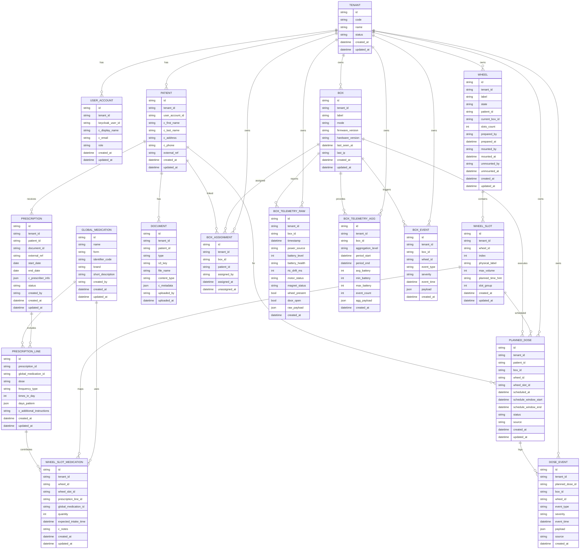

# Schéma de données MEDBOX

## Diagramme de données (ERD)

Ce document détaille le modèle de données du système **MEDBOX**, incluant :

- Les entités métier (patients, prescriptions, wheels…)
- Les données techniques (télémétrie, événements)
- Les champs chiffrés `c_...`
- Les valeurs des ENUM utilisées dans le backend

Toutes les données personnelles (`c_*`) sont chiffrées côté base.

## 🧱 Description détaillée des tables

### TENANT
Représente un tenant (hôpital, établissement…).

| Champ | Type | Description |
|-------|------|-------------|
| id | UUID | Identifiant unique |
| code | string | Code court |
| name | string | Nom complet |
| status | enum(TENANT_STATUS) | Statut du tenant |
| created_at | datetime | Création |
| updated_at | datetime | Mise à jour |

##### ENUM : TENANT_STATUS
- `active`
- `suspended`

---

### USER_ACCOUNT
Utilisateur d’un tenant, lié à Keycloak.

| Champ | Type | Description |
|-------|------|-------------|
| id | UUID | Identifiant interne |
| tenant_id | UUID | FK tenant |
| keycloak_user_id | string | ID Keycloak |
| c_display_name | string | Nom affiché (chiffré) |
| c_email | string | Email chiffré |
| role | enum(USER_ROLE) | Rôle métier |
| created_at | datetime | Création |
| updated_at | datetime | MAJ |

##### ENUM : USER_ROLE
- `patient`
- `caregiver`
- `tenant_admin`
- `global_admin`

---

### PATIENT
Profil médical d’un patient.

| Champ | Type | Description |
|-------|------|-------------|
| id | UUID | Identifiant |
| tenant_id | UUID | FK tenant |
| user_account_id | UUID | FK optionnel → accès patient |
| c_first_name | string | Prénom chiffré |
| c_last_name | string | Nom chiffré |
| c_address | string | Adresse chiffrée |
| c_phone | string | Téléphone chiffré |
| external_ref | string | ID externe SIH |
| created_at | datetime | Création |
| updated_at | datetime | MAJ |

---

### GLOBAL_MEDICATION
Référentiel global de médicaments (non tenant-scopé).

| Champ | Type | Description |
|-------|------|-------------|
| id | UUID | Identifiant |
| name | string | Nom |
| form | string | Forme (comprimé…) |
| identifier_code | string | Code interne |
| brand | string | Marque |
| short_description | string | Description courte |
| created_by | UUID | FK user_creator |
| created_at | datetime | Création |
| updated_at | datetime | MAJ |

---

### PRESCRIPTION
Ordonnance médicale.

| Champ | Type | Description |
|-------|------|-------------|
| id | UUID | ID |
| tenant_id | UUID | FK |
| patient_id | UUID | FK |
| document_id | UUID | Scan de l’ordonnance |
| external_ref | string | Référence SIH |
| start_date | date | Début |
| end_date | date | Fin |
| c_prescriber_info | json | Infos prescripteur (chiffrées) |
| status | enum(PRESCRIPTION_STATUS) | Statut |
| created_by | UUID | Créée par |
| created_at | datetime | Création |
| updated_at | datetime | MAJ |

##### ENUM : PRESCRIPTION_STATUS
- `active`
- `suspended`
- `completed`
- `cancelled`

---

### PRESCRIPTION_LINE
Ligne de prescription.

| Champ | Type | Description |
|-------|------|-------------|
| id | UUID | ID |
| prescription_id | UUID | FK |
| global_medication_id | UUID | FK médoc |
| dose | string | Ex: "1 comprimé" |
| frequency_type | string | fixed_times / interval / prn |
| times_in_day | int | nb prises / jour |
| days_pattern | json | Pattern Jours (1111100) |
| c_additional_instructions | string | Notes chiffrées |
| created_at | datetime | Création |
| updated_at | datetime | MAJ |

---

### DOCUMENT
Fichier (ordonnance, rapport…).

| Champ | Type | Description |
|-------|------|-------------|
| id | UUID | ID |
| tenant_id | UUID | FK |
| patient_id | UUID | FK |
| type | string | Type |
| s3_key | string | Chemin S3 |
| file_name | string | Nom fichier |
| content_type | string | MIME |
| c_metadata | json | Métadonnées chiffrées |
| uploaded_by | UUID | Auteur |
| uploaded_at | datetime | Date upload |

---

### BOX
Boîte MEDBOX physique.

| Champ | Type | Description |
|-------|------|-------------|
| id | UUID | ID (sert aussi de box_uid) |
| tenant_id | UUID | FK |
| label | string | Nom lisible |
| mode | enum(BOX_MODE) | normal / maintenance |
| firmware_version | string | Version firmware |
| hardware_version | string | Version hardware |
| last_seen_at | datetime | Dernier contact |
| last_ip | string | IP |
| created_at | datetime | Création |
| updated_at | datetime | MAJ |

##### ENUM : BOX_MODE
- `normal`
- `maintenance`
- `out_of_service`

---

### BOX_ASSIGNMENT
Lien box ↔ patient (historisé).

| Champ | Type | Description |
|-------|------|-------------|
| id | UUID | ID |
| tenant_id | UUID | FK |
| box_id | UUID | Box |
| patient_id | UUID | Patient |
| assigned_by | UUID | Soignant |
| assigned_at | datetime | Début |
| unassigned_at | datetime | Fin |

---

### WHEEL
Roue contenant les médicaments du patient.

| Champ | Type | Description |
|-------|------|-------------|
| id | UUID | ID (sert de wheel_uid) |
| tenant_id | UUID | FK |
| label | string | Nom lisible |
| state | enum(WHEEL_STATE) | état cycle roue |
| patient_id | UUID | FK |
| current_box_id | UUID | FK box |
| slots_count | int | Nb compartiments |
| prepared_by | UUID | Préparateur |
| prepared_at | datetime | Date |
| mounted_by | UUID | Installateur |
| mounted_at | datetime | Date |
| unmounted_by | UUID | Désinstallateur |
| unmounted_at | datetime | Date |
| created_at | datetime | Création |
| updated_at | datetime | MAJ |

##### ENUM : WHEEL_STATE
- `stock`
- `prepared`
- `mounted`
- `empty`
- `discarded`

---

### WHEEL_SLOT
Compartiment d'une roue.

| Champ | Type | Description |
|-------|------|-------------|
| id | UUID | ID |
| tenant_id | UUID | FK |
| wheel_id | UUID | Roue |
| index | int | Position |
| physical_label | string | Étiquette |
| max_volume | int | Capacité |
| planned_time_hint | string | matin / midi / soir |
| slot_group | int | Groupe logique |
| created_at | datetime | Création |
| updated_at | datetime | MAJ |

---

### WHEEL_SLOT_MEDICATION
Médicaments présents dans un compartiment.

| Champ | Type | Description |
|-------|------|-------------|
| id | UUID | ID |
| tenant_id | UUID | FK |
| wheel_id | UUID | FK |
| wheel_slot_id | UUID | FK |
| prescription_line_id | UUID | FK |
| global_medication_id | UUID | Médoc |
| quantity | int | Nb comprimés |
| expected_intake_time | datetime | Heure prise |
| c_notes | string | Notes chiffrées |
| created_at | datetime | Création |
| updated_at | datetime | MAJ |

---

### PLANNED_DOSE
Une dose planifiée (ordre envoyé à la box).

| Champ | Type | Description |
|-------|------|-------------|
| id | UUID | ID |
| tenant_id | UUID | FK |
| patient_id | UUID | FK |
| box_id | UUID | FK |
| wheel_id | UUID | FK |
| wheel_slot_id | UUID | FK |
| scheduled_at | datetime | Heure exacte |
| schedule_window_start | datetime | Tolérance début |
| schedule_window_end | datetime | Tolérance fin |
| status | enum(PLANNED_DOSE_STATUS) | Statut |
| source | string | auto / manuel |
| created_at | datetime | Création |
| updated_at | datetime | MAJ |

##### ENUM : PLANNED_DOSE_STATUS
- `planned`
- `pending_device_ack`
- `dispensed`
- `missed`
- `skipped`
- `cancelled`

---

### DOSE_EVENT
Historique détaillé d’une prise.

| Champ | Type | Description |
|-------|------|-------------|
| id | UUID | ID |
| tenant_id | UUID | FK |
| planned_dose_id | UUID | FK |
| box_id | UUID | FK |
| wheel_id | UUID | FK |
| event_type | enum(DOSE_EVENT_TYPE) | Nature |
| severity | enum(EVENT_SEVERITY) | Niveau |
| event_time | datetime | Horodate |
| payload | json | Données supplémentaires |
| source | string | device / api / caregiver |
| created_at | datetime | Création |

##### ENUM : DOSE_EVENT_TYPE
- `unlock_command_sent`
- `compartment_unlocked`
- `box_opened`
- `patient_confirmed`
- `timeout`
- `cancelled_by_caregiver`
- `error`
- `info`

##### ENUM : EVENT_SEVERITY
- `info`
- `warning`
- `critical`

---

### BOX_TELEMETRY_RAW
Télémétrie brute envoyée par la box.

| Champ | Type | Description |
|-------|------|-------------|
| id | UUID | ID |
| tenant_id | UUID | FK |
| box_id | UUID | FK |
| timestamp | datetime | Horodate |
| power_source | string | secteur/batterie |
| battery_level | int | 0–100 |
| battery_health | string | état |
| rtc_drift_ms | int | dérive RTC |
| motor_status | string | moteur |
| magnet_status | string | électroaimant |
| wheel_present | bool | Présence roue |
| door_open | bool | Porte ouverte |
| raw_payload | json | Données brutes |
| created_at | datetime | MAJ |

---

### BOX_TELEMETRY_AGG
Agrégations automatiques (journalières, etc.).

| Champ | Type | Description |
|-------|------|-------------|
| id | UUID | ID |
| tenant_id | UUID | FK |
| box_id | UUID | FK |
| aggregation_level | enum(AGG_LEVEL) | taille de fenêtre |
| period_start | datetime | Début |
| period_end | datetime | Fin |
| avg_battery | int | Moyenne |
| min_battery | int | Min |
| max_battery | int | Max |
| event_count | int | Nb événements |
| agg_payload | json | Autres métriques |
| created_at | datetime | Création |

##### ENUM : AGG_LEVEL
- `30m`
- `1h`
- `6h`
- `1d`
- `1w`

---

### BOX_EVENT
Événements techniques.

| Champ | Type | Description |
|-------|------|-------------|
| id | UUID | ID |
| tenant_id | UUID | FK |
| box_id | UUID | FK |
| wheel_id | UUID | FK |
| event_type | enum(EVENT_TYPE) | Type événement |
| severity | enum(EVENT_SEVERITY) | Niveau |
| event_time | datetime | Horodate |
| payload | json | Données |
| created_at | datetime | Création |

##### ENUM : EVENT_TYPE
- `wheel_inserted`
- `wheel_removed`
- `door_open`
- `door_forced`
- `fall_detected`
- `shock_detected`
- `error`
- `heartbeat`
- `firmware_update`